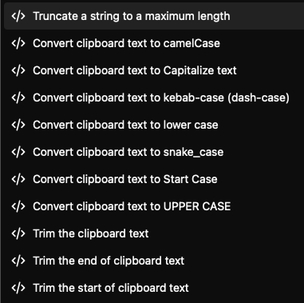

# Kunkun String Utils Extension

[](https://github.com/NaN72dev/kunkun-ext-string-utils/actions/workflows/npm-publish.yml)

This is an extension for [Kunkun](https://docs.kunkun.sh/) that provides a set of string utility functions.

Currently supported functions:



## Development

```bash
pnpm install
```

Start extension in development mode. Every save will trigger a hot reload in Kunkun.

```bash
pnpm dev
```

- During development, right click in Kunkun to open the developer tools.
  - Error messages will be shown in the console.
  - If you got any permission error while calling Kunknu's APIs, make sure you've declared the permission in `package.json`. Then go back to home page and enter the extension again to re-apply the permission.
- To develop and preview the extension in Kunkun, you need to run the `Add Dev Extension` command in Kunkun, and register this extension's path.

Build the extension. Your extension source code can contain many files, but the build process will bundle them into a single file.

```bash
pnpm build
# Due to Bun's bug, if you are on windows, and install dependencies with pnpm, you may get error during build.
# Try install dependencies with bun or npm instead.
```

## i18n

[./src/i18n](./src/i18n/) contains optional internationalization support starter code.

If you want to support i18n, you can use the `t` function to translate the strings in the extension.

User's language setting is available via `app.language()`.

```ts
import { app } from "@kksh/api/ui/template"
import { setupI18n, t } from "./src/i18n"

setupI18n("zh")
console.log(t("welcome"))

setupI18n(await app.language())
console.log(t("welcome"))
```

## Add More Commands

If you want to add more template worker extension commands, simply modify the `entrypoints` array in [./build.ts](./build.ts).

Then in `package.json`, register the new command.

## Verify Build and Publish

```bash
pnpm build # make sure the build npm script works
npx kksh@latest verify # Verify some basic settings
npx kksh@latest verify --publish # Verify some basic settings before publishing
```

See [Documentation](https://docs.kunkun.sh/guides/extensions/publish/design/) for more details on how to publish your extension. You will need to publish your extension package to npm or jsr first with GitHub actioin, then register it on Kunkun's website.

# TODO

[ ] padding
[ ] Truncate